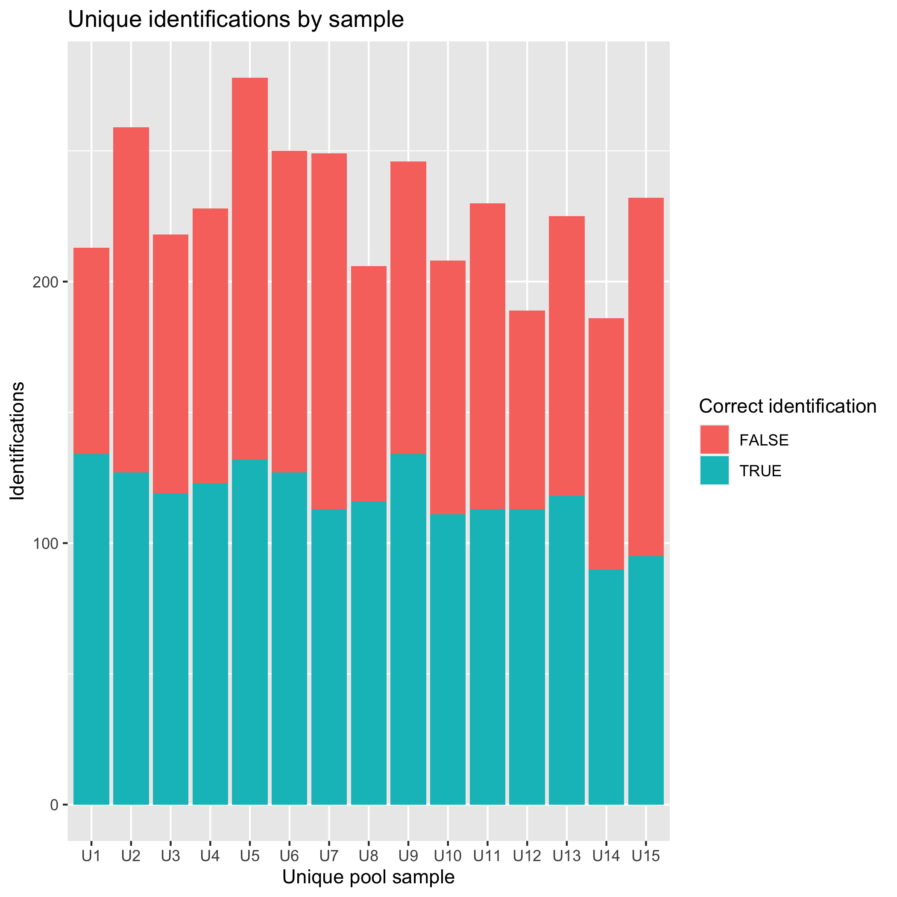
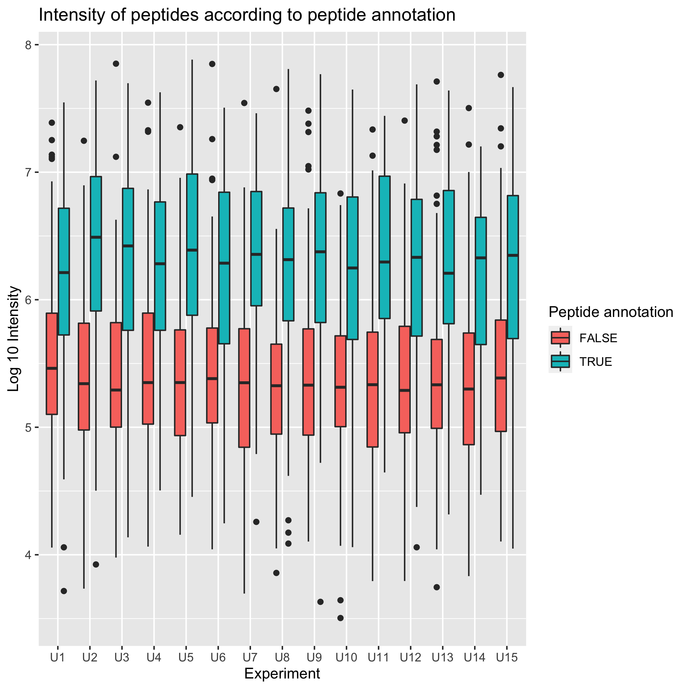
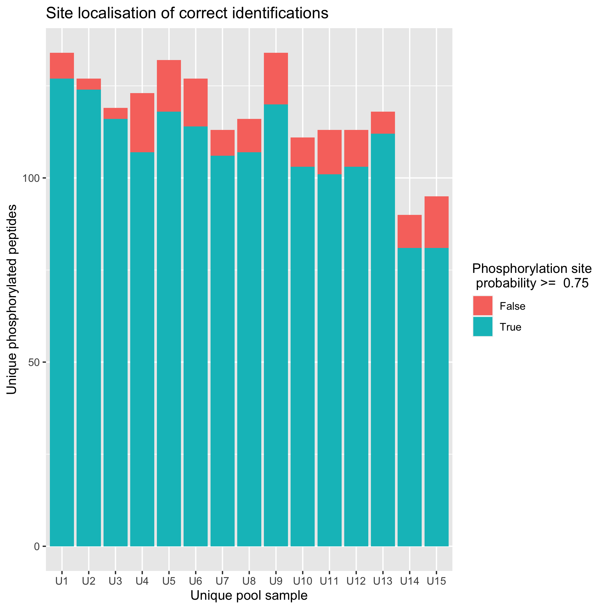
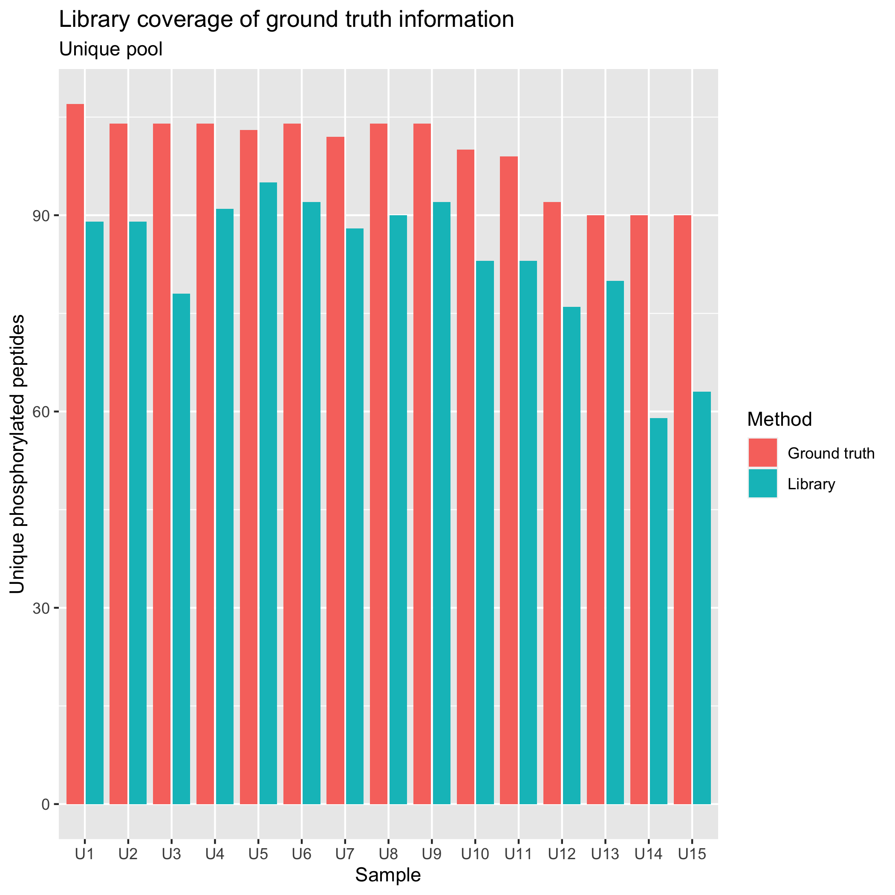
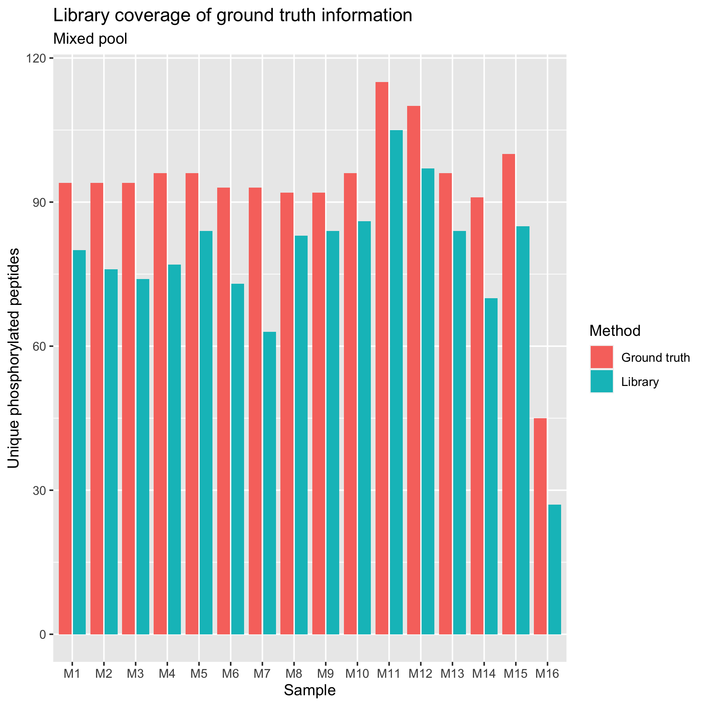
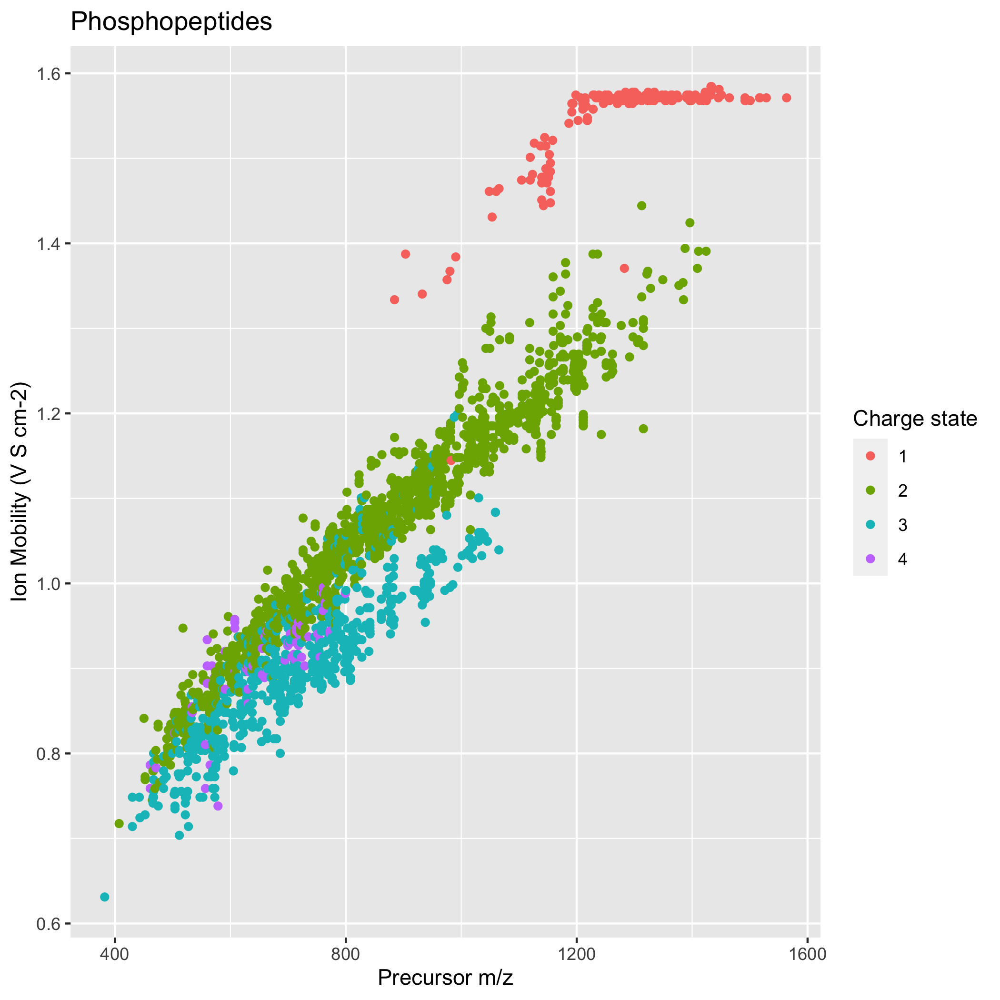
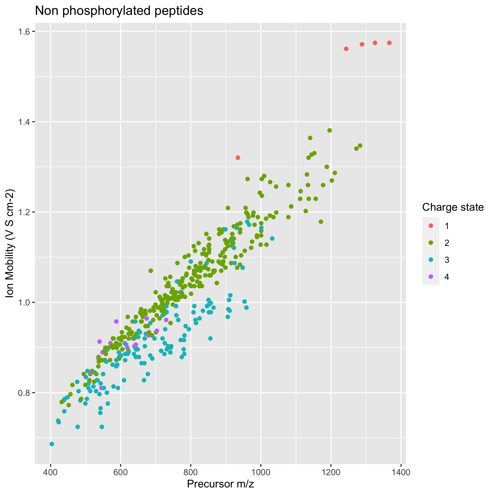
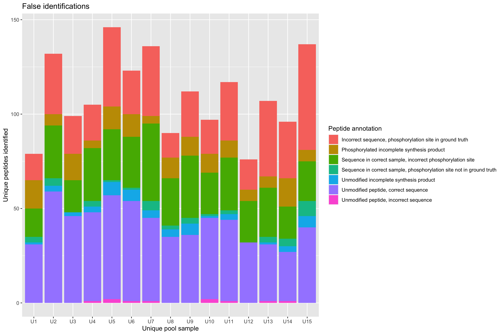
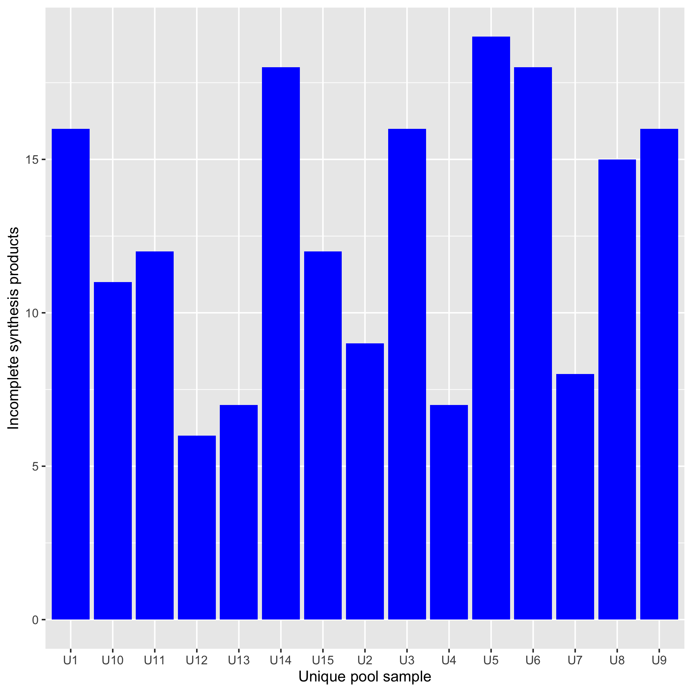

Unique Pool DDA-PASEF Results
================
Aparna
07/06/2022

-   [Identifications](#identifications)
-   [Intensity](#intensity)
-   [Site localisation threshold](#site-localisation-threshold)
-   [How much of ground truth does the library
    cover?](#how-much-of-ground-truth-does-the-library-cover)
-   [IM vs mz](#im-vs-mz)
-   [Incomplete Synthesis Products](#incomplete-synthesis-products)
-   [Previous results (from sciex)](#previous-results-from-sciex)

Ground truth upool - site localised peptide is found in correct u pool
sample ground truth sequence upool - peptide sequence is in the upool
sample Ground truth sequence - peptide sequence is in ground truth list
ground truth localisation - site loclaised peptide is in the ground
truth list protein in gt - peptide sequence is in the fasta database

# Identifications

True denotes phosphorylated sequences that should be in the sample
<!-- -->

| n\_distinct(FullPeptideName\_phospho) |
|--------------------------------------:|
|                                  1333 |

# Intensity

    ## Warning: Removed 3 rows containing non-finite values (stat_boxplot).

<!-- -->

# Site localisation threshold

<!-- -->

| SiteProb | n\_distinct(FullPeptideName) |
|---------:|-----------------------------:|
|        0 |                          145 |
|        1 |                         1620 |

# How much of ground truth does the library cover?

Upool

<!-- -->

| method       | U\_pool | n\_distinct(FullPeptideName\_phospho) |
|:-------------|:--------|--------------------------------------:|
| Ground truth | U1      |                                   107 |
| Ground truth | U10     |                                   100 |
| Ground truth | U11     |                                    99 |
| Ground truth | U12     |                                    92 |
| Ground truth | U13     |                                    90 |
| Ground truth | U14     |                                    90 |
| Ground truth | U15     |                                    90 |
| Ground truth | U2      |                                   104 |
| Ground truth | U3      |                                   104 |
| Ground truth | U4      |                                   104 |
| Ground truth | U5      |                                   103 |
| Ground truth | U6      |                                   104 |
| Ground truth | U7      |                                   102 |
| Ground truth | U8      |                                   104 |
| Ground truth | U9      |                                   104 |
| Library      | U1      |                                    89 |
| Library      | U10     |                                    83 |
| Library      | U11     |                                    83 |
| Library      | U12     |                                    76 |
| Library      | U13     |                                    80 |
| Library      | U14     |                                    59 |
| Library      | U15     |                                    63 |
| Library      | U2      |                                    89 |
| Library      | U3      |                                    78 |
| Library      | U4      |                                    91 |
| Library      | U5      |                                    95 |
| Library      | U6      |                                    92 |
| Library      | U7      |                                    88 |
| Library      | U8      |                                    90 |
| Library      | U9      |                                    92 |

| method       | n\_distinct(FullPeptideName\_phospho) |
|:-------------|--------------------------------------:|
| Ground truth |                                  1497 |
| Library      |                                  1248 |

Mpool

<!-- -->

| method       | M\_pool | n\_distinct(FullPeptideName\_phospho) |
|:-------------|:--------|--------------------------------------:|
| Ground truth | M1      |                                    94 |
| Ground truth | M10     |                                    96 |
| Ground truth | M11     |                                   115 |
| Ground truth | M12     |                                   110 |
| Ground truth | M13     |                                    96 |
| Ground truth | M14     |                                    91 |
| Ground truth | M15     |                                   100 |
| Ground truth | M16     |                                    45 |
| Ground truth | M2      |                                    94 |
| Ground truth | M3      |                                    94 |
| Ground truth | M4      |                                    96 |
| Ground truth | M5      |                                    96 |
| Ground truth | M6      |                                    93 |
| Ground truth | M7      |                                    93 |
| Ground truth | M8      |                                    92 |
| Ground truth | M9      |                                    92 |
| Library      | M1      |                                    80 |
| Library      | M10     |                                    86 |
| Library      | M11     |                                   105 |
| Library      | M12     |                                    97 |
| Library      | M13     |                                    84 |
| Library      | M14     |                                    70 |
| Library      | M15     |                                    85 |
| Library      | M16     |                                    27 |
| Library      | M2      |                                    76 |
| Library      | M3      |                                    74 |
| Library      | M4      |                                    77 |
| Library      | M5      |                                    84 |
| Library      | M6      |                                    73 |
| Library      | M7      |                                    63 |
| Library      | M8      |                                    83 |
| Library      | M9      |                                    84 |

# IM vs mz

<!-- --><!-- -->

\#False IDs
<!-- -->

# Incomplete Synthesis Products

Anything with protein in gt == true and sequence in gt == false means it
is an incomplete synthesis product.

<!-- -->

\#Missing IDs

Missed during openms library generation for a reason i don’t know

Library stats

``` r
knitr::kable(library %>% summarise(n_distinct(FullPeptideName)))
```

| n\_distinct(FullPeptideName) |
|-----------------------------:|
|                         1982 |

``` r
knitr::kable(library %>% filter(!grepl("UniMod:21",FullPeptideName_phospho)) %>% summarise(n_distinct(FullPeptideName)))
```

| n\_distinct(FullPeptideName) |
|-----------------------------:|
|                          340 |

``` r
knitr::kable(library %>% filter(grepl("UniMod:21",FullPeptideName_phospho)) %>% summarise(n_distinct(FullPeptideName)))
```

| n\_distinct(FullPeptideName) |
|-----------------------------:|
|                         1642 |

``` r
knitr::kable(library %>% filter(grepl("UniMod:21",FullPeptideName_phospho)) %>% summarise(n_distinct(FullPeptideName_phospho)))
```

| n\_distinct(FullPeptideName\_phospho) |
|--------------------------------------:|
|                                  1248 |

# Previous results (from sciex)

``` r
# format_modified_sequence <- function(mod_seq){
#   mod_seq = gsub("\\(Carbamidomethyl\\)", "", mod_seq)
#   mod_seq = gsub("\\(Phosphorylation\\)", "\\(UniMod:21\\)", mod_seq)
#   mod_seq = gsub("\\(Oxidation\\)", "\\(UniMod:35\\)", mod_seq)
#   return(mod_seq)
# }
# 
# triple_tof_lib <- data.table::fread("/Users/aparnasrinivasan/Desktop/MScThesis/Data/Christian_Doerig_data/UK_dpp/ConsLib_5600_dpp_UK_peakview_curated_2.tsv") %>% mutate(FullUniModPeptideName = format_modified_sequence(FullPeptideName)) %>% mutate(FullPeptideName_phospho = phospho_formatting(FullUniModPeptideName)) %>% select(-decoy, -V1, -FullPeptideName) %>% rename(FullPeptideName = FullUniModPeptideName) 
```

``` r
# df.2 <- rbind(library %>% filter(grepl("UniMod:21", FullPeptideName)) %>% select(FullPeptideName) %>% mutate(FullPeptideName_phospho = phospho_formatting(FullPeptideName)) %>% select(-FullPeptideName) %>% distinct() %>%  left_join(ground_truth %>% select(U_pool, ModifiedPeptideSequence_phos), by=c("FullPeptideName_phospho" = "ModifiedPeptideSequence_phos")) %>% mutate(method = "timsTOF Library"), 
#               triple_tof_lib %>% filter(grepl("UniMod:21", FullPeptideName)) %>% select(FullPeptideName_phospho) %>% distinct() %>% 
#  left_join(ground_truth %>% select(U_pool, ModifiedPeptideSequence_phos), by=c("FullPeptideName_phospho" = "ModifiedPeptideSequence_phos")) %>% mutate(method = "TripleTOF LIB"), 
#               ground_truth %>% select(ModifiedPeptideSequence_phos, U_pool) %>% rename(FullPeptideName_phospho=ModifiedPeptideSequence_phos) %>% mutate(method = "Ground truth")) 
# 
# ggplot(df.2, aes(x=factor(U_pool, levels=samples), fill=method)) + geom_bar(position = position_dodge2(preserve = "single")) + 
#   xlab("Sample") + 
#   ylab("Unique phosphorylated peptides") +
#   labs(fill="Method") + 
#   ggtitle("Library coverage of ground truth information")
# 
# ggplot(df.2, aes(x=method)) + geom_bar() + 
#   xlab("Sample") + 
#   ylab("Unique phosphorylated peptides") +
#   labs(fill="Method") + 
#   ggtitle("Library coverage of ground truth information")
# 
# df.2 <- rbind(df.1 %>% filter(ground_truth_upool == TRUE) %>% filter(grepl("UniMod:21",FullPeptideName)) %>% select(ModifiedPeptideSequence_phos,Experiment) %>% distinct() %>% mutate(method = "timsTOF library") %>% rename(FullPeptideName_phospho = ModifiedPeptideSequence_phos, U_pool=Experiment),
#    triple_tof_lib %>% filter(grepl("UniMod:21", FullPeptideName)) %>% select(FullPeptideName_phospho) %>% distinct() %>% 
#  left_join(ground_truth %>% select(U_pool, ModifiedPeptideSequence_phos), by=c("FullPeptideName_phospho" = "ModifiedPeptideSequence_phos")) %>% mutate(method = "TripleTOF library"), 
#               ground_truth %>% select(ModifiedPeptideSequence_phos, U_pool) %>% rename(FullPeptideName_phospho=ModifiedPeptideSequence_phos) %>% mutate(method = "Ground truth")) 
# 
# ggplot(df.2, aes(x=method)) + geom_bar() + 
#   scale_x_discrete(breaks=c("Ground truth", "timsTOF library", "TripleTOF library"), labels=c("Ground truth", "timsTOF DDA-PASEF", "TripleTOF DDA")) + 
#   xlab("Method") + 
#   ylab("Unique phosphorylated peptides") +
#   labs(fill="Method") + 
#   ggtitle("Unique pool coverage of ground truth list")
# 
# # this plot shows timstof and triple tof results without qc on timstof
# 
# 
# knitr::kable(df.2 %>% group_by(method) %>% summarise(n_distinct(FullPeptideName_phospho)))
```
