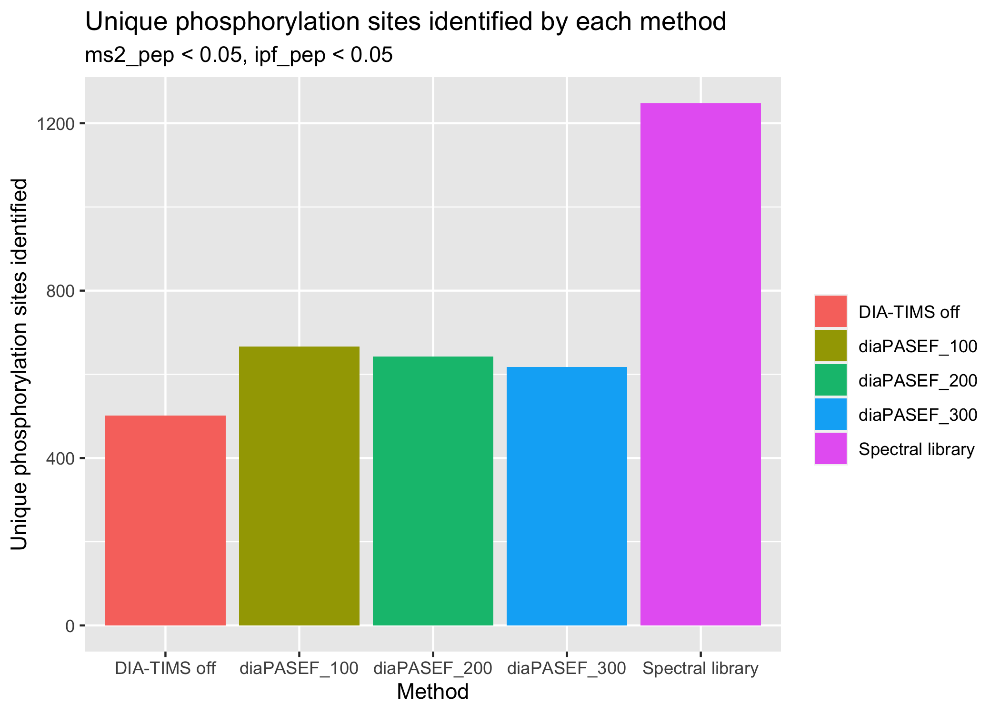

Summary figures of DIA and diaPASEF results
================
Aparna
05/05/2022

Total unique peptides identified Total unique phosphorylation sites
identified Plots by overall methods and by sample

<!-- -->

<!-- -->

<!-- -->

| method           | mpool\_gt | percentage\_decrease |
|:-----------------|:----------|---------------------:|
| DIA-TIMS off     | FALSE     |            0.6039823 |
| DIA-TIMS off     | TRUE      |            0.0691214 |
| diaPASEF\_100    | FALSE     |            0.3012884 |
| diaPASEF\_100    | TRUE      |            0.0334789 |
| diaPASEF\_200    | FALSE     |            0.3587866 |
| diaPASEF\_200    | TRUE      |            0.0319635 |
| diaPASEF\_300    | FALSE     |            0.3743258 |
| diaPASEF\_300    | TRUE      |            0.0565476 |
| Spectral library | TRUE      |            0.0000000 |

<!-- -->

| method           | mpool\_gt | percentage\_decrease |
|:-----------------|:----------|---------------------:|
| DIA-TIMS off     | FALSE     |            0.8212291 |
| DIA-TIMS off     | TRUE      |            0.6703678 |
| diaPASEF\_100    | FALSE     |            0.6680851 |
| diaPASEF\_100    | TRUE      |            0.4503012 |
| diaPASEF\_200    | FALSE     |            0.7259380 |
| diaPASEF\_200    | TRUE      |            0.4386792 |
| diaPASEF\_300    | FALSE     |            0.6827586 |
| diaPASEF\_300    | TRUE      |            0.4731861 |
| Spectral library | TRUE      |            0.0000000 |

<!-- --><!-- -->

| method           | Unique\_phoshorylation\_sites |
|:-----------------|------------------------------:|
| DIA-TIMS off     |                           501 |
| diaPASEF\_100    |                           666 |
| diaPASEF\_200    |                           643 |
| diaPASEF\_300    |                           618 |
| Spectral library |                          1248 |

<!-- -->
