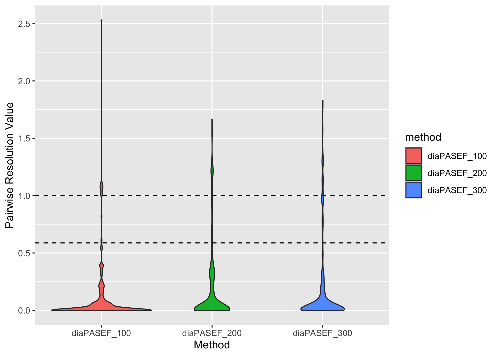

Co-eluting isomer Figures
================
Aparna
27/06/2022

-   [All isomers](#all-isomers)
-   [Site localised co-eluting
    isomers](#site-localised-co-eluting-isomers)
-   [Non site localised phosphopeptide
    isomers](#non-site-localised-phosphopeptide-isomers)

Summaries

| n\_distinct(isomer\_pair) |
|--------------------------:|
|                       616 |

| n\_distinct(isomer\_pair\_name) |
|--------------------------------:|
|                             389 |

| n\_distinct(Sequence) |
|----------------------:|
|                   169 |

| ipf\_pep\_pass | n\_distinct(isomer\_pair) |
|---------------:|--------------------------:|
|              0 |                       212 |
|              1 |                       332 |
|              2 |                        72 |

Methods

    ## # A tibble: 3 × 4
    ##   method       `n_distinct(isomer_pair)` `n_distinct(isomer_p…` `n_distinct(Se…`
    ##   <chr>                            <int>                  <int>            <int>
    ## 1 diaPASEF_100                       257                    233              117
    ## 2 diaPASEF_200                       191                    183              104
    ## 3 diaPASEF_300                       168                    161              101

    ## # A tibble: 9 × 3
    ## # Groups:   method [3]
    ##   method       ipf_pep_pass `n_distinct(isomer_pair)`
    ##   <chr>               <int>                     <int>
    ## 1 diaPASEF_100            0                        96
    ## 2 diaPASEF_100            1                       128
    ## 3 diaPASEF_100            2                        33
    ## 4 diaPASEF_200            0                        64
    ## 5 diaPASEF_200            1                       106
    ## 6 diaPASEF_200            2                        21
    ## 7 diaPASEF_300            0                        52
    ## 8 diaPASEF_300            1                        98
    ## 9 diaPASEF_300            2                        18

    ## # A tibble: 3 × 3
    ##   method       `mean(delta_IM_alphatims)` `median(delta_IM_alphatims)`
    ##   <chr>                             <dbl>                        <dbl>
    ## 1 diaPASEF_100                    0.00585                     0       
    ## 2 diaPASEF_200                    0.00772                     0.000558
    ## 3 diaPASEF_300                    0.00686                     0.000371

Individual peptides

| method        | ipf\_pep &lt; 0.05 | n\_distinct(FullPeptideName) |
|:--------------|:-------------------|-----------------------------:|
| diaPASEF\_100 | FALSE              |                          205 |
| diaPASEF\_100 | TRUE               |                          143 |
| diaPASEF\_200 | FALSE              |                          166 |
| diaPASEF\_200 | TRUE               |                          116 |
| diaPASEF\_300 | FALSE              |                          154 |
| diaPASEF\_300 | TRUE               |                          106 |

| method        | ipf\_pep &lt; 0.05 | n\_distinct(FullPeptideName\_phospho) |
|:--------------|:-------------------|--------------------------------------:|
| diaPASEF\_100 | FALSE              |                                   172 |
| diaPASEF\_100 | TRUE               |                                   133 |
| diaPASEF\_200 | FALSE              |                                   151 |
| diaPASEF\_200 | TRUE               |                                   112 |
| diaPASEF\_300 | FALSE              |                                   142 |
| diaPASEF\_300 | TRUE               |                                   101 |

Ion mobility analysis

# All isomers

    ## Warning: Removed 23 rows containing missing values (geom_point).

<!-- -->

    ## Warning: Removed 23 rows containing missing values (geom_point).

<!-- -->

| method        | delta\_IM\_alphatims &lt; median\_peakwidth | n\_distinct(isomer\_pair) |
|:--------------|:--------------------------------------------|--------------------------:|
| diaPASEF\_100 | FALSE                                       |                        18 |
| diaPASEF\_100 | TRUE                                        |                       229 |
| diaPASEF\_100 | NA                                          |                        10 |
| diaPASEF\_200 | FALSE                                       |                        27 |
| diaPASEF\_200 | TRUE                                        |                       162 |
| diaPASEF\_200 | NA                                          |                         2 |
| diaPASEF\_300 | FALSE                                       |                        21 |
| diaPASEF\_300 | TRUE                                        |                       136 |
| diaPASEF\_300 | NA                                          |                        11 |

| method        | median(IM\_precursor\_pp\_resolution) |
|:--------------|--------------------------------------:|
| diaPASEF\_100 |                             0.0000000 |
| diaPASEF\_200 |                             0.0181925 |
| diaPASEF\_300 |                             0.0168098 |

    ## Warning: Continuous limits supplied to discrete scale.
    ## Did you mean `limits = factor(...)` or `scale_*_continuous()`?

<!-- --><!-- --><!-- --><!-- --><!-- --><!-- --><!-- -->

| method        | IM\_precursor\_pp\_resolution &lt; 1 | n\_distinct(isomer\_pair) |
|:--------------|:-------------------------------------|--------------------------:|
| diaPASEF\_100 | FALSE                                |                        11 |
| diaPASEF\_100 | TRUE                                 |                       236 |
| diaPASEF\_100 | NA                                   |                        10 |
| diaPASEF\_200 | FALSE                                |                        14 |
| diaPASEF\_200 | TRUE                                 |                       175 |
| diaPASEF\_200 | NA                                   |                         2 |
| diaPASEF\_300 | FALSE                                |                        11 |
| diaPASEF\_300 | TRUE                                 |                       146 |
| diaPASEF\_300 | NA                                   |                        11 |

| method        | IM\_precursor\_pp\_resolution &lt; 0.588 | n\_distinct(isomer\_pair) |
|:--------------|:-----------------------------------------|--------------------------:|
| diaPASEF\_100 | FALSE                                    |                        14 |
| diaPASEF\_100 | TRUE                                     |                       233 |
| diaPASEF\_100 | NA                                       |                        10 |
| diaPASEF\_200 | FALSE                                    |                        21 |
| diaPASEF\_200 | TRUE                                     |                       168 |
| diaPASEF\_200 | NA                                       |                         2 |
| diaPASEF\_300 | FALSE                                    |                        20 |
| diaPASEF\_300 | TRUE                                     |                       137 |
| diaPASEF\_300 | NA                                       |                        11 |

| IM\_precursor\_pp\_resolution &lt; 1 | n\_distinct(isomer\_pair) |
|:-------------------------------------|--------------------------:|
| FALSE                                |                        36 |
| TRUE                                 |                       557 |
| NA                                   |                        23 |

| IM\_precursor\_pp\_resolution &lt; 0.588 | n\_distinct(isomer\_pair) |
|:-----------------------------------------|--------------------------:|
| FALSE                                    |                        55 |
| TRUE                                     |                       538 |
| NA                                       |                        23 |

# Site localised co-eluting isomers

    ## Warning: Removed 2 rows containing missing values (geom_point).

<!-- -->

| method        | delta\_IM\_alphatims &lt; median\_peakwidth | n\_distinct(isomer\_pair) |
|:--------------|:--------------------------------------------|--------------------------:|
| diaPASEF\_100 | FALSE                                       |                         6 |
| diaPASEF\_100 | TRUE                                        |                        25 |
| diaPASEF\_100 | NA                                          |                         2 |
| diaPASEF\_200 | FALSE                                       |                         6 |
| diaPASEF\_200 | TRUE                                        |                        15 |
| diaPASEF\_300 | FALSE                                       |                         3 |
| diaPASEF\_300 | TRUE                                        |                        15 |

    ## Warning: Continuous limits supplied to discrete scale.
    ## Did you mean `limits = factor(...)` or `scale_*_continuous()`?

<!-- -->

| IM\_precursor\_pp\_resolution &lt; 1 | n\_distinct(isomer\_pair) |
|:-------------------------------------|--------------------------:|
| FALSE                                |                        11 |
| TRUE                                 |                        59 |
| NA                                   |                         2 |

| IM\_precursor\_pp\_resolution &lt; 0.5 | n\_distinct(isomer\_pair) |
|:---------------------------------------|--------------------------:|
| FALSE                                  |                        17 |
| TRUE                                   |                        53 |
| NA                                     |                         2 |

# Non site localised phosphopeptide isomers

    ## Warning: Removed 21 rows containing missing values (geom_point).

<!-- -->

| method        | delta\_IM\_alphatims &lt; median\_peakwidth | n\_distinct(isomer\_pair) |
|:--------------|:--------------------------------------------|--------------------------:|
| diaPASEF\_100 | FALSE                                       |                        12 |
| diaPASEF\_100 | TRUE                                        |                       204 |
| diaPASEF\_100 | NA                                          |                         8 |
| diaPASEF\_200 | FALSE                                       |                        21 |
| diaPASEF\_200 | TRUE                                        |                       147 |
| diaPASEF\_200 | NA                                          |                         2 |
| diaPASEF\_300 | FALSE                                       |                        18 |
| diaPASEF\_300 | TRUE                                        |                       121 |
| diaPASEF\_300 | NA                                          |                        11 |

    ## Warning: Continuous limits supplied to discrete scale.
    ## Did you mean `limits = factor(...)` or `scale_*_continuous()`?

<!-- -->

| IM\_precursor\_pp\_resolution &lt; 1 | n\_distinct(isomer\_pair) |
|:-------------------------------------|--------------------------:|
| FALSE                                |                        25 |
| TRUE                                 |                       498 |
| NA                                   |                        21 |

| IM\_precursor\_pp\_resolution &lt; 0.5 | n\_distinct(isomer\_pair) |
|:---------------------------------------|--------------------------:|
| FALSE                                  |                        44 |
| TRUE                                   |                       479 |
| NA                                     |                        21 |
