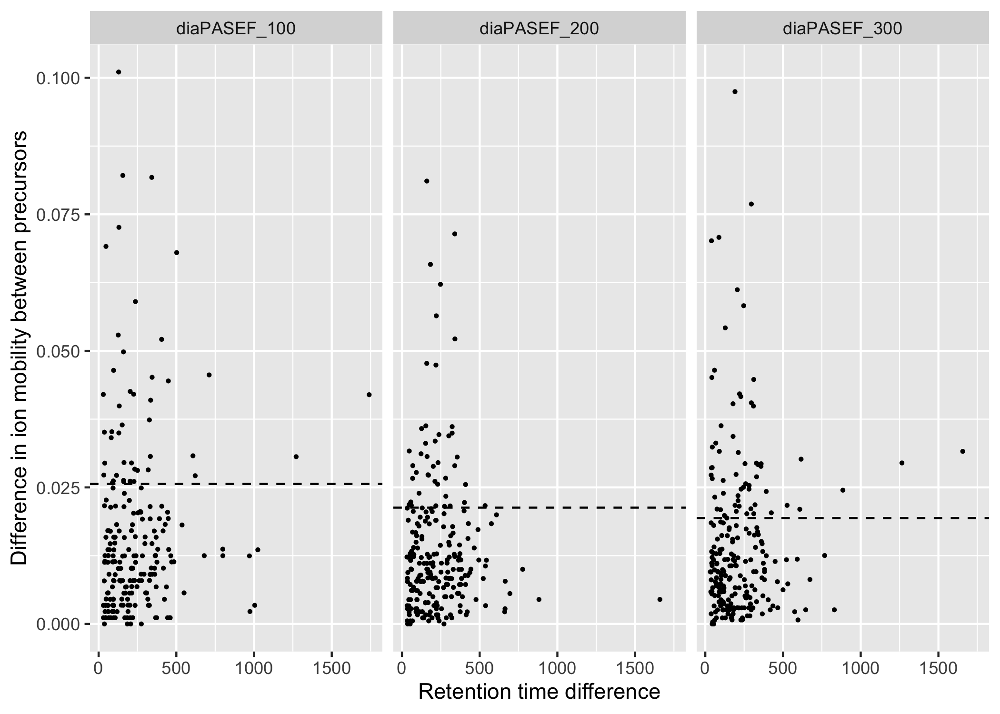
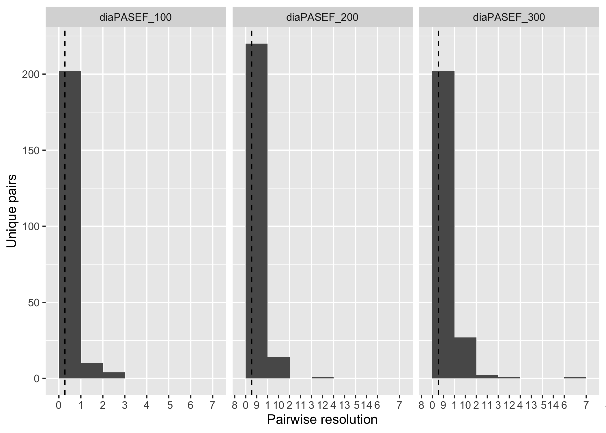
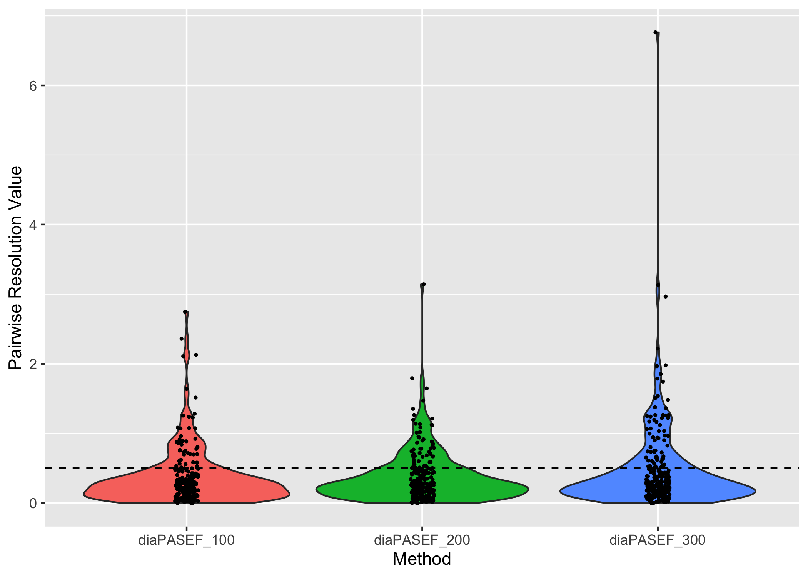
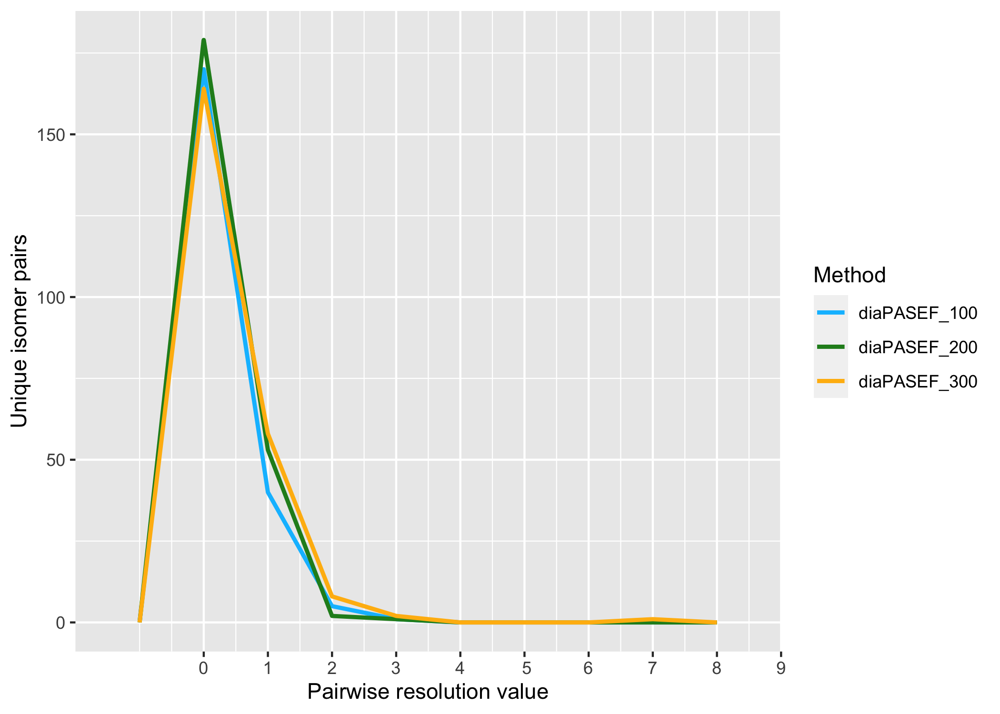

Non co-eluting phosphopeptide isomers
================
Aparna
29/06/2022

Summaries

``` {r}d
knitr::kable(non_coeluting_isomer_pairs  %>% summarise(n_distinct(isomer_pair)))

knitr::kable(non_coeluting_isomer_pairs %>% summarise(n_distinct(isomer_pair_name)))

knitr::kable(non_coeluting_isomer_pairs %>% summarise(n_distinct(Sequence)))
```

Methods

| method        | n\_distinct(isomer\_pair) | n\_distinct(isomer\_pair\_name) | n\_distinct(Sequence) |
|:--------------|--------------------------:|--------------------------------:|----------------------:|
| diaPASEF\_100 |                       221 |                             201 |                   146 |
| diaPASEF\_200 |                       243 |                             216 |                   133 |
| diaPASEF\_300 |                       239 |                             213 |                   127 |

| method        | n\_distinct(isomer\_pair) |
|:--------------|--------------------------:|
| diaPASEF\_100 |                       221 |
| diaPASEF\_200 |                       243 |
| diaPASEF\_300 |                       239 |

| method        | mean(delta\_IM\_alphatims) | median(delta\_IM\_alphatims) |
|:--------------|---------------------------:|-----------------------------:|
| diaPASEF\_100 |                  0.0163250 |                    0.0119303 |
| diaPASEF\_200 |                  0.0135013 |                    0.0100286 |
| diaPASEF\_300 |                  0.0143942 |                    0.0099868 |

Individual peptides

| method        | ipf\_pep &lt; 0.05 | n\_distinct(FullPeptideName) |
|:--------------|:-------------------|-----------------------------:|
| diaPASEF\_100 | TRUE               |                          360 |
| diaPASEF\_200 | TRUE               |                          358 |
| diaPASEF\_300 | TRUE               |                          340 |

    ## Warning: Removed 19 rows containing missing values (geom_point).

<!-- -->

| method        | delta\_IM\_alphatims &lt; median\_peakwidth | n\_distinct(isomer\_pair) |
|:--------------|:--------------------------------------------|--------------------------:|
| diaPASEF\_100 | FALSE                                       |                        44 |
| diaPASEF\_100 | TRUE                                        |                       172 |
| diaPASEF\_100 | NA                                          |                         5 |
| diaPASEF\_200 | FALSE                                       |                        42 |
| diaPASEF\_200 | TRUE                                        |                       193 |
| diaPASEF\_200 | NA                                          |                         8 |
| diaPASEF\_300 | FALSE                                       |                        61 |
| diaPASEF\_300 | TRUE                                        |                       172 |
| diaPASEF\_300 | NA                                          |                         6 |

    ## Warning: Continuous limits supplied to discrete scale.
    ## Did you mean `limits = factor(...)` or `scale_*_continuous()`?

<!-- --><!-- --><!-- --><!-- --><!-- -->

| method        | IM\_precursor\_pp\_resolution &lt; 1 | n\_distinct(isomer\_pair) |
|:--------------|:-------------------------------------|--------------------------:|
| diaPASEF\_100 | FALSE                                |                        14 |
| diaPASEF\_100 | TRUE                                 |                       202 |
| diaPASEF\_100 | NA                                   |                         5 |
| diaPASEF\_200 | FALSE                                |                        15 |
| diaPASEF\_200 | TRUE                                 |                       220 |
| diaPASEF\_200 | NA                                   |                         8 |
| diaPASEF\_300 | FALSE                                |                        31 |
| diaPASEF\_300 | TRUE                                 |                       202 |
| diaPASEF\_300 | NA                                   |                         6 |

| method        | IM\_precursor\_pp\_resolution &lt; 0.5 | n\_distinct(isomer\_pair) |
|:--------------|:---------------------------------------|--------------------------:|
| diaPASEF\_100 | FALSE                                  |                        46 |
| diaPASEF\_100 | TRUE                                   |                       170 |
| diaPASEF\_100 | NA                                     |                         5 |
| diaPASEF\_200 | FALSE                                  |                        56 |
| diaPASEF\_200 | TRUE                                   |                       179 |
| diaPASEF\_200 | NA                                     |                         8 |
| diaPASEF\_300 | FALSE                                  |                        69 |
| diaPASEF\_300 | TRUE                                   |                       164 |
| diaPASEF\_300 | NA                                     |                         6 |

| IM\_precursor\_pp\_resolution &lt; 1 | n\_distinct(isomer\_pair) |
|:-------------------------------------|--------------------------:|
| FALSE                                |                        60 |
| TRUE                                 |                       624 |
| NA                                   |                        19 |

| IM\_precursor\_pp\_resolution &lt; 0.5 | n\_distinct(isomer\_pair) |
|:---------------------------------------|--------------------------:|
| FALSE                                  |                       171 |
| TRUE                                   |                       513 |
| NA                                     |                        19 |

| method        | median(IM\_precursor\_pp\_resolution) |
|:--------------|--------------------------------------:|
| diaPASEF\_100 |                             0.2724938 |
| diaPASEF\_200 |                             0.2738163 |
| diaPASEF\_300 |                             0.2689072 |
