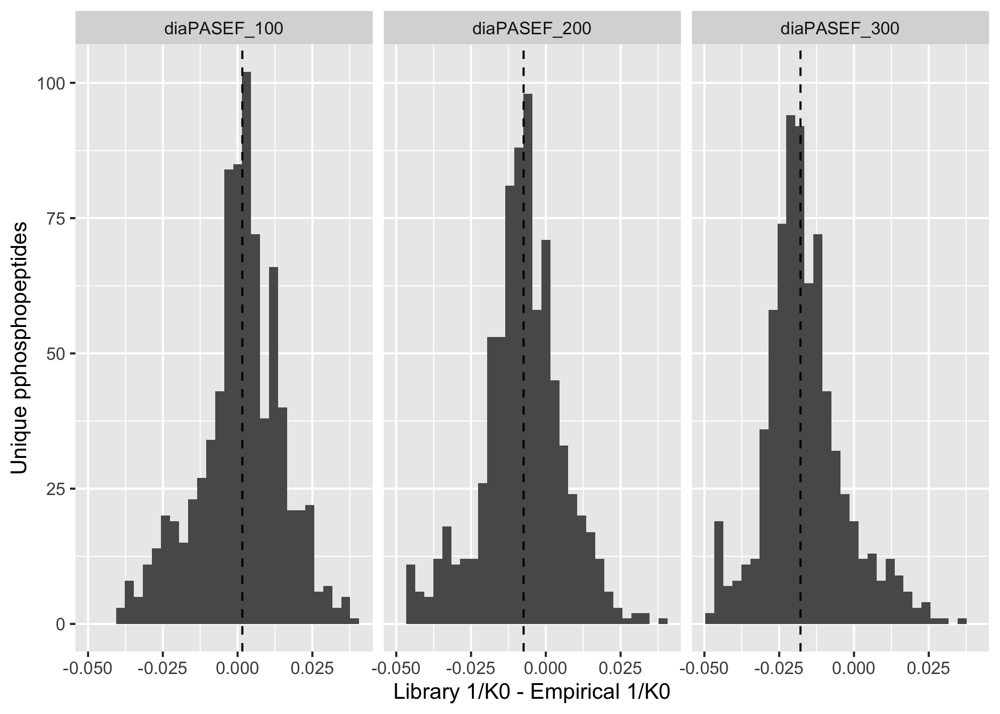
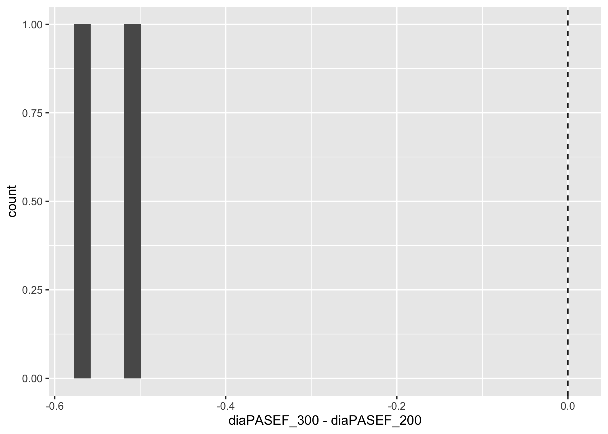

Untitled
================
Aparna
30/06/2022

-   [Adjusting peak widths for peaks with prominence &gt; FWHM
    intensity](#adjusting-peak-widths-for-peaks-with-prominence--fwhm-intensity)
-   [Comparison of Library IM with Raw
    IM](#comparison-of-library-im-with-raw-im)
-   [Resolving power and peak width](#resolving-power-and-peak-width)
-   [Examples of isomers found in multiple
    pairs](#examples-of-isomers-found-in-multiple-pairs)
-   [Theoretical Delta IM](#theoretical-delta-im)

# Adjusting peak widths for peaks with prominence &gt; FWHM intensity

# Comparison of Library IM with Raw IM

<!-- -->

# Resolving power and peak width

| method        |  mean(R) | median(R) | median(smoothed\_IM\_peakwidth) |
|:--------------|---------:|----------:|--------------------------------:|
| diaPASEF\_100 | 38.60068 |  38.28907 |                       0.0256373 |
| diaPASEF\_200 | 51.12481 |  46.27937 |                       0.0212934 |
| diaPASEF\_300 | 59.79169 |  52.59812 |                       0.0193841 |

<!-- --><!-- -->

    ## # A tibble: 3 × 3
    ##   method       mean_diff median_diff
    ##   <chr>            <dbl>       <dbl>
    ## 1 diaPASEF_100    0.0162     0.0114 
    ## 2 diaPASEF_200    0.0139     0.0106 
    ## 3 diaPASEF_300    0.0137     0.00955

# Examples of isomers found in multiple pairs

    ## Warning: Removed 3 rows containing non-finite values (stat_bin).

<!-- -->

    ## Warning: Removed 5 rows containing non-finite values (stat_bin).

<!-- -->

    ## Warning: Removed 6 rows containing non-finite values (stat_bin).

<!-- -->

# Theoretical Delta IM

Number of unique isomer pairs = 1872

| Charge | n\_distinct(isomer\_pair) | median(delta\_IM) | mean(delta\_IM) |
|-------:|--------------------------:|------------------:|----------------:|
|      1 |                       125 |         0.0033285 |       0.0090814 |
|      2 |                      1631 |         0.0102082 |       0.0156357 |
|      3 |                       622 |         0.0171126 |       0.0258667 |
|      4 |                        28 |         0.0205022 |       0.0235848 |

| Charge | delta\_IM &gt; 0.0256 | n\_distinct(isomer\_pair) |
|-------:|:----------------------|--------------------------:|
|      1 | FALSE                 |                       113 |
|      1 | TRUE                  |                        12 |
|      2 | FALSE                 |                      1357 |
|      2 | TRUE                  |                       274 |
|      3 | FALSE                 |                       400 |
|      3 | TRUE                  |                       222 |
|      4 | FALSE                 |                        15 |
|      4 | TRUE                  |                        13 |

    ##     Min.  1st Qu.   Median     Mean  3rd Qu.     Max. 
    ## 0.000000 0.003424 0.010264 0.018033 0.023783 0.203885

<!-- --><!-- --><!-- -->
