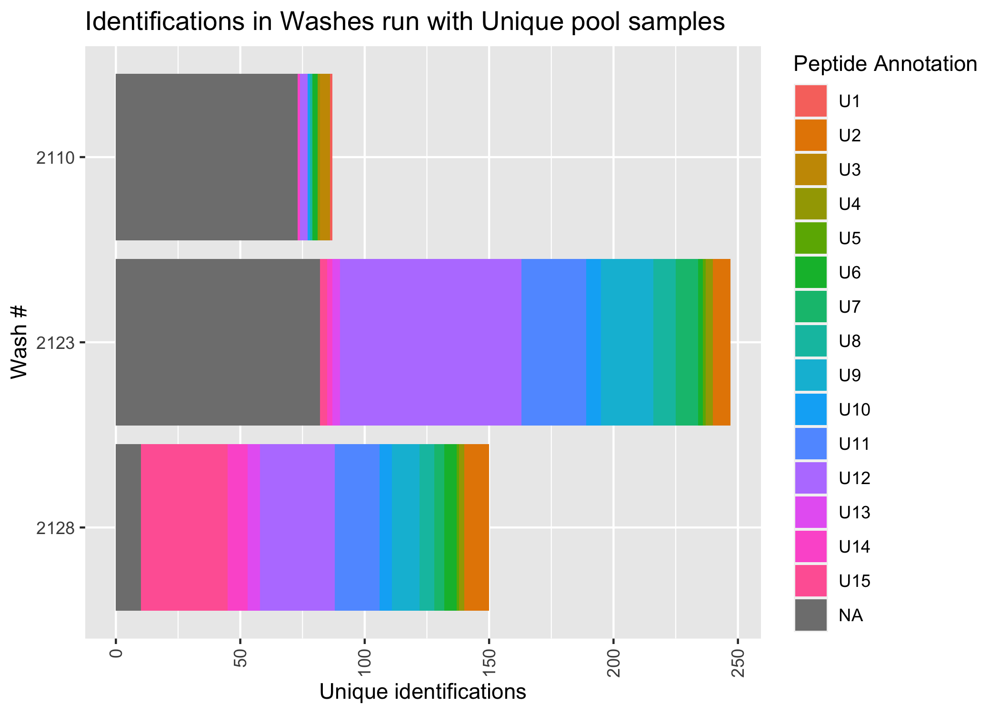
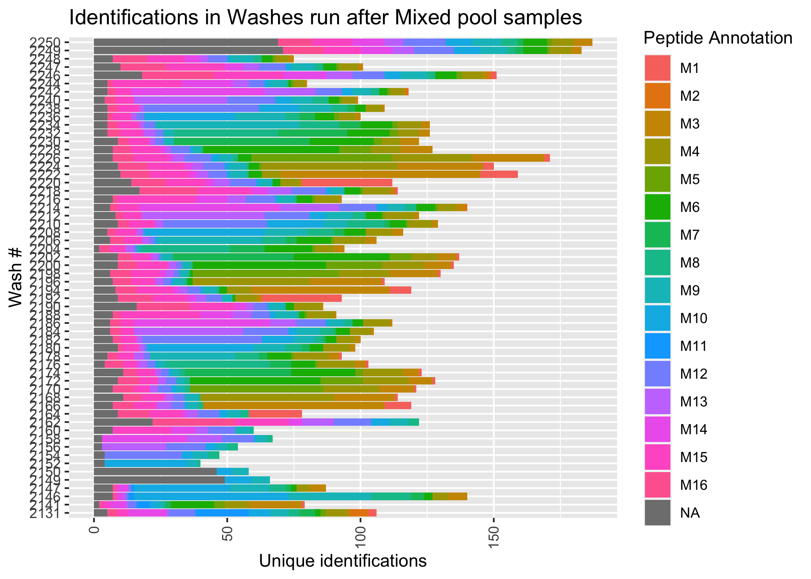
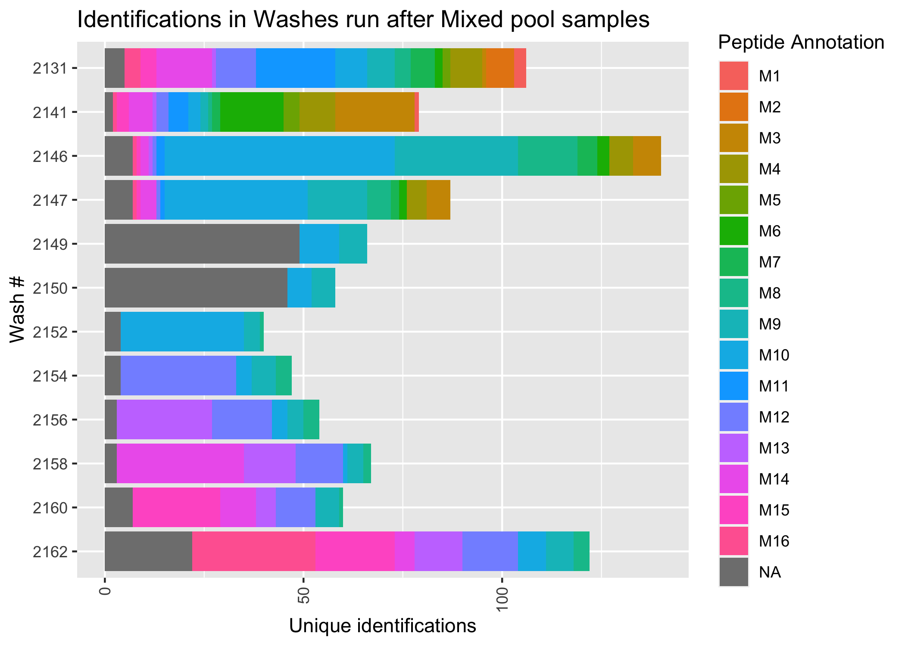
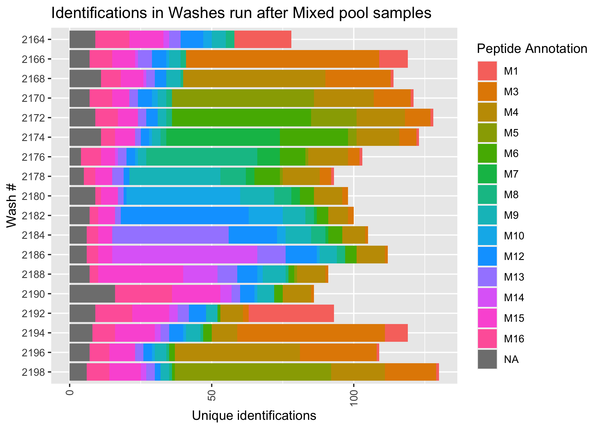
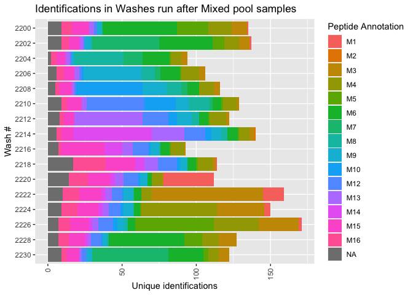
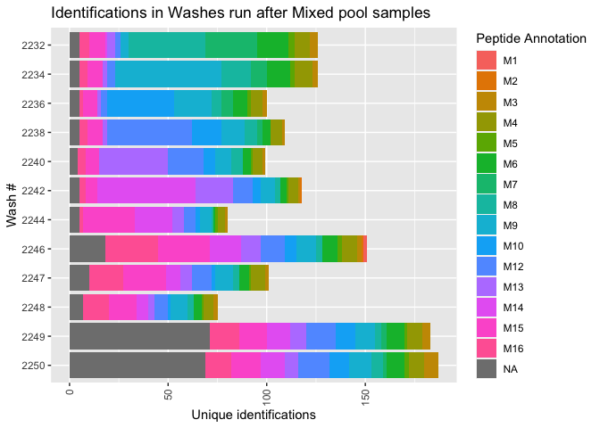

Washes
================
Aparna
04/02/2022

``` r
ground_truth <- data.table::fread("/Users/aparnasrinivasan/Desktop/MScThesis/Srinivasan_MS_Thesis/Data/ground_truth_table.tsv") 

washes <- data.table::fread("/Users/aparnasrinivasan/Desktop/MScThesis/Srinivasan_MS_Thesis/Data/Raw_Data_Search_Results/Wash_runs/wash_runs_mq_evidence.txt") %>% rowwise() %>% mutate(FullPeptideName_phospho = format_modified_sequence(`Modified sequence`)) %>% left_join(ground_truth %>% select(FullPeptideName_phospho, U_pool,M_pool), by="FullPeptideName_phospho") 

samples = c("U1", "U2", "U3", "U4", "U5", "U6", "U7", "U8", "U9", "U10", "U11", "U12", "U13", "U14", "U15")
```

``` r
df.1 <- washes %>% select(Sequence, `Modified sequence`, `Phospho (STY) Probabilities`, Proteins, `Raw file`, Experiment,`m/z`, `Retention time`, `1/K0`, `PEP`, Reverse, Intensity,`Potential contaminant`, FullPeptideName_phospho, U_pool, M_pool)
```

``` r
ggplot(df.1 %>% filter(Experiment %in% c(2110, 2123,2128)) %>% group_by(`Modified sequence`, `Raw file`) %>% slice(which.min(PEP)), aes(x=factor(Experiment), fill=factor(U_pool, levels = c(samples, "Other Protein")))) + 
  geom_bar() + 
  theme(axis.text.x = element_text(angle = 90, vjust = 0.5, hjust=1)) + labs(fill="Peptide Annotation") +
  xlab("Wash #") + 
  ylab("Unique identifications") +
  ggtitle("Identifications in Washes run with Unique pool samples") + 
  coord_flip() + 
  scale_x_discrete(limits=rev(factor(c(2110,2123,2128))))
```

<!-- -->

``` r
M_samples = c("M1", "M2", "M3", "M4", "M5", "M6", "M7", "M8", "M9", "M10", "M11", "M12", "M13", "M14", "M15", "M16")

ggplot(df.1 %>% filter(! Experiment %in% c(2110, 2123,2128)) %>% group_by(`Modified sequence`, `Raw file`) %>% slice(which.min(PEP)), aes(x=factor(Experiment), fill=factor(M_pool, levels = c(M_samples, "Other Protein")))) + geom_bar() + theme(axis.text.x = element_text(angle = 90, vjust = 0.5, hjust=1)) + labs(fill="Peptide Annotation") +
  xlab("Wash #") + 
  ylab("Unique identifications") +
  ggtitle("Identifications in Washes run after Mixed pool samples") +
  coord_flip() 
```

<!-- -->

``` r
ggplot(df.1 %>% filter(Experiment %in% c(2131,2141,2146,2147,2149,2150,2152,2154,2156,2158,2160,2162)) %>% group_by(`Modified sequence`, `Raw file`) %>% slice(which.min(PEP)), aes(x=factor(Experiment), fill=factor(M_pool, levels = c(M_samples, "Other Protein")))) + geom_bar() + theme(axis.text.x = element_text(angle = 90, vjust = 0.5, hjust=1)) + labs(fill="Peptide Annotation") +
  xlab("Wash #") + 
  ylab("Unique identifications") +
  ggtitle("Identifications in Washes run after Mixed pool samples") +
  coord_flip() +
  scale_x_discrete(limits=rev(factor(c(2131,2141,2146,2147,2149,2150,2152,2154,2156,2158,2160,2162))))
```

<!-- -->

``` r
ggplot(df.1 %>% filter(Experiment %in% seq(2164,2198,2)) %>% group_by(`Modified sequence`, `Raw file`) %>% slice(which.min(PEP)), aes(x=factor(Experiment), fill=factor(M_pool, levels = c(M_samples, "Other Protein")))) + geom_bar() + theme(axis.text.x = element_text(angle = 90, vjust = 0.5, hjust=1)) + labs(fill="Peptide Annotation") +
  xlab("Wash #") + 
  ylab("Unique identifications") +
  ggtitle("Identifications in Washes run after Mixed pool samples") +
  coord_flip() +
  scale_x_discrete(limits=rev(factor(seq(2164,2198,2))))
```

<!-- -->

``` r
ggplot(df.1 %>% filter(Experiment %in% seq(2200,2230,2)) %>% group_by(`Modified sequence`, `Raw file`) %>% slice(which.min(PEP)), aes(x=factor(Experiment), fill=factor(M_pool, levels = c(M_samples, "Other Protein")))) + geom_bar() + theme(axis.text.x = element_text(angle = 90, vjust = 0.5, hjust=1)) + labs(fill="Peptide Annotation") +
  xlab("Wash #") + 
  ylab("Unique identifications") +
  ggtitle("Identifications in Washes run after Mixed pool samples") +
  coord_flip() +
  scale_x_discrete(limits=rev(factor(seq(2200,2230,2))))
```

<!-- -->

``` r
ggplot(df.1 %>% filter(Experiment %in% c(2232,2234,2236,2238,2240,2242,2244,2246,2247,2248,2249,2250)) %>% group_by(`Modified sequence`, `Raw file`) %>% slice(which.min(PEP)), aes(x=factor(Experiment), fill=factor(M_pool, levels = c(M_samples, "Other Protein")))) + geom_bar() + theme(axis.text.x = element_text(angle = 90, vjust = 0.5, hjust=1)) + labs(fill="Peptide Annotation") +
  xlab("Wash #") + 
  ylab("Unique identifications") +
  ggtitle("Identifications in Washes run after Mixed pool samples") +
  coord_flip() +
  scale_x_discrete(limits=rev(factor(c(2232,2234,2236,2238,2240,2242,2244,2246,2247,2248,2249,2250))))
```

<!-- -->
