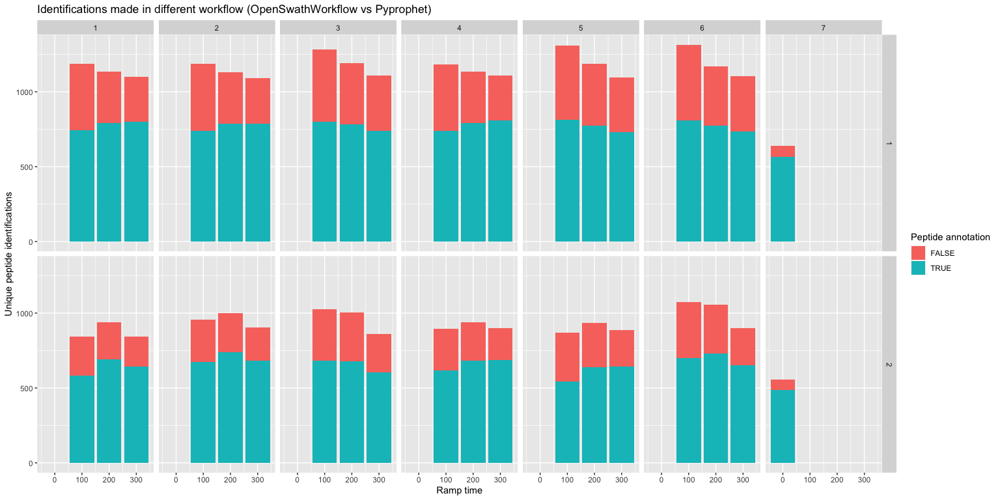
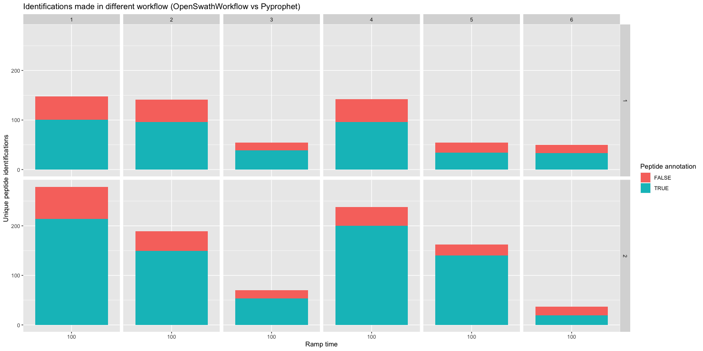
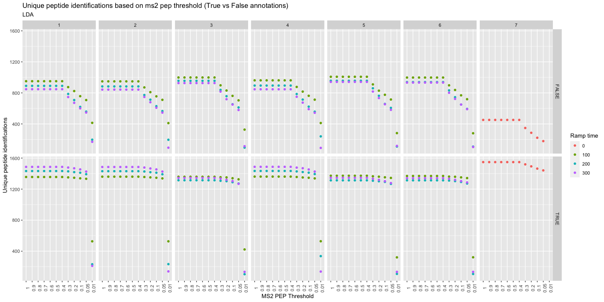
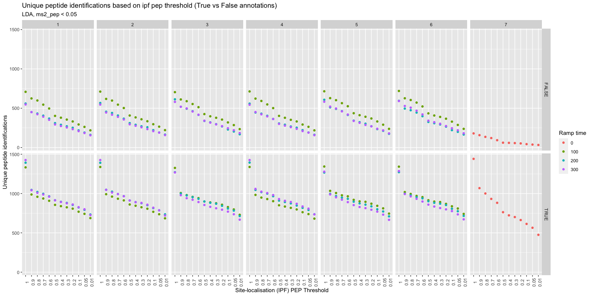
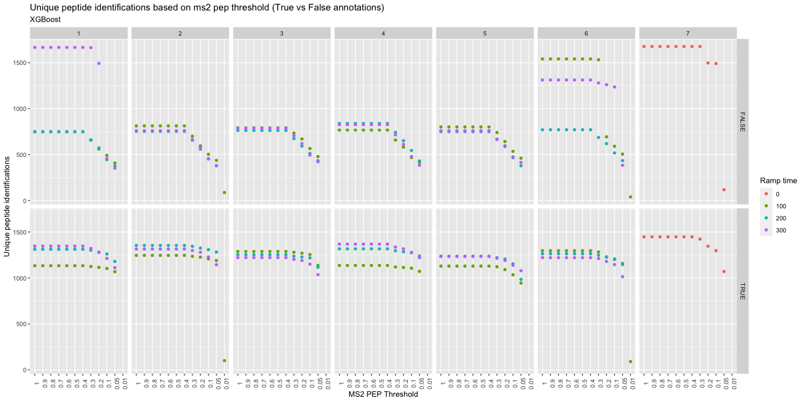
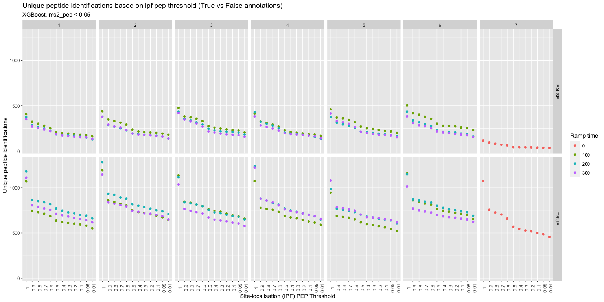

Workflow\_Optimization
================
Aparna
03/05/2022

-   [October 2021 Data](#october-2021-data)
-   [March 2022 Data](#march-2022-data)
-   [MS2 / IPF scoring performance with XGBoost
    classifier](#ms2--ipf-scoring-performance-with-xgboost-classifier)

OpenSwathWorkflow \# 7 - DIA (TIMS off) OpenSwathWorkflow (no ms1)

OpenSwathWorkflow \# 1 - diapasef, ms1 on, no ion mobility scores used
OpenSwathWorkflow \# 2 - diapasef, ms1 on, extraction window = -1
OpenSwathWorkflow \# 3 - diapasef, ms1 on, extraction window = 0.06
OpenSwathWorkflow \# 4 - diapasef, ms1 off, extraction window = -1
OpenSwathWorkflow \# 5 - diapasef, ms1 off, extraction window = 0.06
OpenSwathWorkflow \# 6 - diapasef, ms1 off, extraction window = 0.06,
extra drift time = 0.25

Pyprophet workflow \# 1 - LDA Pyprophet workflow \# 2 - XGboost

# October 2021 Data

<!-- -->

Overall, Openswathworkflow \#5 seems to have best results, although
they’re all pretty similar. LDA classifier seems to do better than
XGBoost.

# March 2022 Data

\*Re run of mixed pool samples with 100ms ramp time, reduced injection
volume and increased washes

<!-- -->

\#MS2 / IPF scoring performance with LDA Classifier. \* Ramp time 0
refers to DIA (TIMS off)
<!-- --><!-- -->

# MS2 / IPF scoring performance with XGBoost classifier

-   Ramp time 0 refers to DIA (TIMS off)
    <!-- --><!-- -->
